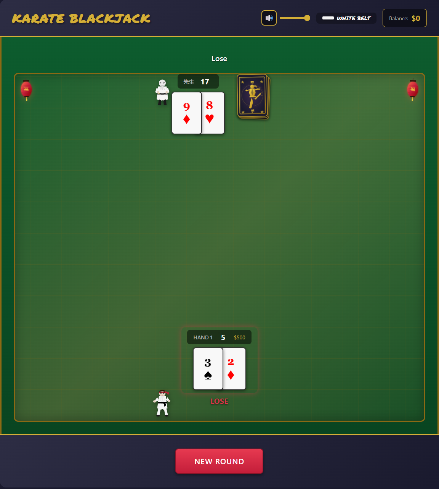

# Karate Blackjack

A karate-themed browser-based blackjack game with retro arcade aesthetics, synthesized sound effects, and smooth animations.

[](https://karate-blackjack.netlify.app)
[](LICENSE)
[](https://developer.mozilla.org/en-US/docs/Web/JavaScript)

<p align="center">
  <a href="https://karate-blackjack.netlify.app">
    
  </a>
</p>

<p align="center">
  <strong><a href="https://karate-blackjack.netlify.app">Play Karate Blackjack</a></strong>
</p>

---

## Features

### Gameplay
- **Standard Blackjack Rules** - Hit, Stand, Double Down, Split
- **Multi-Hand Support** - Play 1-3 hands simultaneously
- **Insurance** - Available when dealer shows an Ace
- **H17 Rule** - Dealer hits on soft 17
- **Split Pairs** - Split matching cards (including 10-value cards)
- **Blackjack Pays 3:2** - Natural blackjack pays 1.5x your bet

### Karate Theme
- **Dojo Environment** - Tatami mat pattern table with wood borders
- **Character Avatars** - Sensei (dealer) and Karateka (player)
- **Animated Lanterns** - Traditional Japanese lanterns with fortune kanji
- **Custom Face Cards** - Karate-themed King, Queen, and Jack designs
- **Belt Rank System** - Progress from White Belt to Black Belt based on balance

### Belt Ranks
| Rank | Balance Required |
|------|-----------------|
| White Belt | $0+ |
| Yellow Belt | $500+ |
| Orange Belt | $1,000+ |
| Green Belt | $2,000+ |
| Blue Belt | $3,500+ |
| Purple Belt | $5,000+ |
| Brown Belt | $7,500+ |
| Red Belt | $10,000+ |
| Black Belt | $15,000+ |

### Audio
- **17 Retro Sound Effects** - 8-bit arcade-style sounds synthesized with Web Audio API
- **Volume Control** - Adjustable volume with mute toggle
- **Persistent Settings** - Volume preferences saved to localStorage

### Visual Effects
- **Card Animations** - Smooth dealing, flipping, and stacking
- **Chip Animations** - Betting chips with placement and payout effects
- **Impact Effects** - Screen shake on bust, victory/defeat poses
- **Responsive Design** - Works on desktop, tablet, and mobile

## Getting Started

### Prerequisites
- Node.js 18+ (for development)
- Modern web browser (Chrome, Firefox, Safari, Edge)

### Installation

```bash
# Clone the repository
git clone https://github.com/Zxela/karate_blackjack.git
cd karate_blackjack

# Install dependencies
npm install

# Start development server
npm start
```

The game will be available at `http://localhost:3000`

### Quick Play
Simply open `index.html` in a web browser - no server required for basic play.

## Development

### Project Structure
```
karate-blackjack/
├── assets/              # SVG assets (avatars, cards, lanterns)
├── css/
│   └── styles.css       # All styles (mobile-first, responsive)
├── js/
│   ├── audio/           # Sound system
│   │   ├── AudioManager.js
│   │   ├── SoundSynthesizer.js
│   │   └── soundDefinitions.js
│   ├── game/            # Game logic
│   │   ├── GameEngine.js
│   │   ├── Hand.js
│   │   ├── CardDeck.js
│   │   ├── BettingSystem.js
│   │   └── DealerAI.js
│   ├── state/           # State management
│   │   ├── GameStateMachine.js
│   │   └── StorageManager.js
│   ├── ui/              # UI components
│   │   ├── AnimationCoordinator.js
│   │   ├── AnimationManager.js
│   │   ├── CardRenderer.js
│   │   └── AssetLoader.js
│   ├── types/           # TypeScript-style type definitions
│   │   └── index.js
│   └── main.js          # Application entry point
├── __tests__/           # Unit tests (Vitest)
├── e2e/                 # E2E tests (Playwright)
├── index.html           # Main HTML file
└── package.json
```

### Scripts

```bash
# Run unit tests
npm test

# Run unit tests in watch mode
npm run test:watch

# Run E2E tests
npm run test:e2e

# Run E2E tests with UI
npm run test:e2e:ui

# Format code
npm run format

# Lint code
npm run lint
```

### Testing

**Unit Tests** - 1159 tests covering:
- Game engine logic
- Hand calculations
- Betting system
- State machine transitions
- Audio manager
- Animation coordinator

**E2E Tests** - 55 tests covering:
- Full gameplay flows
- Betting interactions
- Split/Double Down
- Insurance
- Volume controls
- Responsive behavior

### Architecture

The game uses a clean separation of concerns:

- **GameEngine** - Core blackjack logic, rules enforcement
- **GameStateMachine** - Phase transitions (betting → dealing → player turn → dealer turn → resolution)
- **AnimationCoordinator** - Canvas-based animations synchronized with game state
- **AudioManager** - Web Audio API sound synthesis
- **StorageManager** - localStorage persistence for settings and game state

## House Rules

| Rule | Setting |
|------|---------|
| Decks | 6 |
| Dealer Hits Soft 17 | Yes |
| Blackjack Pays | 3:2 |
| Insurance Pays | 2:1 |
| Double After Split | Yes |
| Resplit | No |
| Max Hands | 3 |
| Surrender | No |

## Browser Support

- Chrome 90+
- Firefox 88+
- Safari 14+
- Edge 90+

## Performance

- Lightweight (~50KB JS, ~30KB CSS)
- No external dependencies for gameplay
- 60fps animations on modern devices
- Lazy-loaded assets

## License

This project is licensed under the MIT License - see the [LICENSE](LICENSE) file for details.

## Contributing

Contributions are welcome! Please see [CONTRIBUTING.md](CONTRIBUTING.md) for guidelines.

## Acknowledgments

- Card game logic inspired by standard casino blackjack rules
- Retro sound design inspired by classic 8-bit fighting games
- Karate theme elements drawn from traditional martial arts aesthetics
