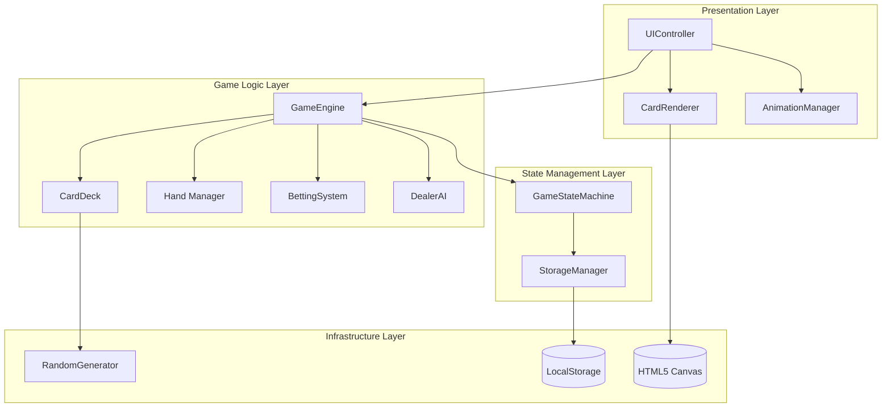
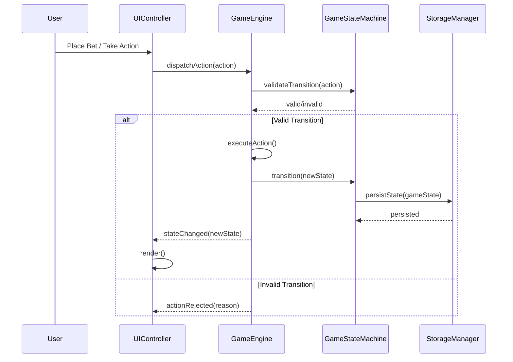
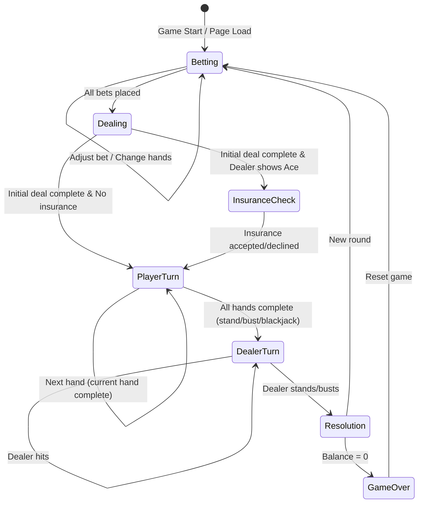
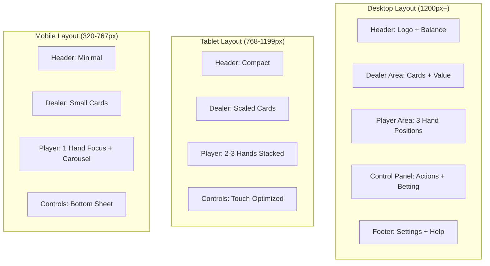

# Karate Blackjack - Technical Design Document

## Overview

This document defines the technical architecture and implementation design for Karate Blackjack, a browser-based blackjack game featuring karate-themed card art with support for 1-3 simultaneous hands. The game runs entirely client-side using vanilla HTML5, CSS3, and JavaScript with Canvas API for card rendering.

## Design Summary (Meta)

```yaml
design_type: "new_feature"
risk_level: "medium"
main_constraints:
  - "Pure vanilla JavaScript (no frameworks)"
  - "Client-side only (no backend)"
  - "Bundle size under 2MB"
  - "Support 320px to 1920px screen widths"
  - "60fps animation performance target"
biggest_risks:
  - "Card art asset production delays"
  - "Mobile touch interaction responsiveness"
  - "State persistence across page refresh"
unknowns:
  - "Exact card art asset specifications (dimensions, format)"
  - "Analytics implementation approach"
```

## Background and Context

### Prerequisite ADRs

No existing ADRs. This is the initial design for a greenfield project.

### Agreement Checklist

#### Scope
- [x] Standard blackjack game logic implementation
- [x] Multi-hand support (1-3 hands)
- [x] All player actions: Hit, Stand, Double Down, Split, Insurance
- [x] Virtual currency betting system
- [x] Karate-themed card art rendering
- [x] Responsive browser UI (320px-1920px)
- [x] Game state persistence via Local Storage

#### Non-Scope (Explicitly not changing)
- [x] No real money gambling
- [x] No multiplayer/PvP functionality
- [x] No user accounts or server-side persistence
- [x] No leaderboards
- [x] No native mobile apps

#### Constraints
- [x] Parallel operation: Not applicable (new project)
- [x] Backward compatibility: Not applicable
- [x] Performance measurement: Required (100ms interaction response, 30fps minimum)

### Problem to Solve

Create an engaging, visually distinctive blackjack game that:
1. Runs entirely in the browser without installation
2. Supports advanced gameplay (multi-hand, all standard actions)
3. Provides a unique karate-themed visual experience
4. Works across desktop and mobile devices

### Current Challenges

N/A - Greenfield project

### Requirements

#### Functional Requirements

From PRD (FR-001 through FR-020):
- Standard blackjack rules with correct card values
- All player actions (hit, stand, double, split, insurance)
- 1-3 simultaneous hands
- Virtual currency betting system
- Karate-themed card art (52 cards + card back)
- Responsive UI across devices
- Game state display and round resolution

#### Non-Functional Requirements

- **Performance**:
  - Initial load under 3 seconds on 3G
  - UI response within 100ms
  - Minimum 30fps animations
- **Reliability**:
  - Support latest 2 versions of Chrome, Firefox, Safari, Edge
  - State recovery on page refresh
- **Security**:
  - Cryptographically secure card shuffling
- **Accessibility**:
  - 4.5:1 contrast ratio
  - 44x44px minimum touch targets
  - Full keyboard navigation

## Acceptance Criteria (AC) - EARS Format

### AC-001: Card Value Calculation

- [x] The system shall calculate number cards (2-10) at face value
  - **Property**: `cardValue(card) === card.rank` for ranks 2-10
- [x] The system shall calculate face cards (J, Q, K) as value 10
  - **Property**: `cardValue(faceCard) === 10`
- [x] The system shall calculate Ace as 11 when hand total is 10 or less, otherwise as 1
  - **Property**: `softAce === (handTotal + 11 <= 21)`

### AC-002: Dealer Behavior

- [x] **While** dealer's hand total is 16 or less, the dealer shall hit
- [x] **While** dealer's hand total is 17 or more, the dealer shall stand
- [x] **When** dealer has soft 17 (Ace counted as 11), the dealer shall stand

### AC-003: Player Actions - Hit

- [x] **When** player selects "Hit" on an active hand, **then** one card is dealt to that hand
- [x] **If** hand total exceeds 21 after hit, **then** hand is marked as bust
- [x] **While** hand is bust, "Hit" action shall be disabled for that hand

### AC-004: Player Actions - Stand

- [x] **When** player selects "Stand", **then** the current hand's turn ends
- [x] **If** all player hands have completed, **then** dealer reveals hidden card and plays

### AC-005: Player Actions - Double Down

- [x] **When** player has exactly 2 cards and sufficient balance, "Double Down" shall be enabled
- [x] **When** player selects "Double Down", **then** bet is doubled and exactly one card is dealt
- [x] **If** balance is insufficient for doubling, **then** "Double Down" shall be disabled

### AC-006: Player Actions - Split

- [x] **When** player has exactly 2 cards of equal value, "Split" shall be enabled
- [x] **When** player selects "Split", **then** cards are separated into two hands
- [x] **If** split hand is Aces, **then** each Ace receives exactly one card (no further actions)
  - **Property**: `splitAces.forEach(hand => hand.cards.length === 2)`

### AC-007: Player Actions - Insurance

- [x] **When** dealer's face-up card is Ace, insurance offer shall be displayed
- [x] **When** player accepts insurance, **then** half of original bet is placed as side bet
- [x] **If** dealer has blackjack, **then** insurance pays 2:1
- [x] **If** dealer does not have blackjack, **then** insurance bet is lost

### AC-008: Multi-Hand Support

- [x] **When** player selects hand count (1-3), **then** that number of betting positions appears
- [x] The system shall process hands sequentially from left to right
- [x] **While** a hand is active, it shall be visually highlighted
  - **Property**: `activeHand.visualState === 'highlighted'`

### AC-009: Betting System

- [x] The system shall provide starting balance of 1000 chips
- [x] **When** bet is placed, **then** balance is decreased by bet amount
- [x] **If** player wins, **then** balance increases by bet amount (2:1 for blackjack at 3:2)
- [x] **If** push occurs, **then** original bet is returned
  - **Property**: `push => balance === previousBalance`

### AC-010: Blackjack Payout

- [x] **When** player has blackjack (Ace + 10-value in 2 cards), **then** payout is 3:2
  - **Property**: `blackjackPayout === bet * 1.5`
- [x] **If** both player and dealer have blackjack, **then** result is push

### AC-011: Card Art Display

- [x] **When** any card is displayed face-up, **then** karate-themed artwork is shown
- [x] **When** any card is face-down, **then** karate-themed card back is shown
- [x] The card shall display clear suit and value identification

### AC-012: Responsive UI

- [x] **When** viewport width is 320px-767px, **then** mobile layout is rendered
- [x] **When** viewport width is 768px-1199px, **then** tablet layout is rendered
- [x] **When** viewport width is 1200px+, **then** desktop layout is rendered
- [x] Touch targets shall be minimum 44x44 pixels
  - **Property**: `touchTarget.width >= 44 && touchTarget.height >= 44`

### AC-013: State Persistence

- [x] **When** page is refreshed during active round, **then** game state is restored
- [x] **When** new session starts, **then** previous balance is loaded from storage

### AC-014: Game State Display

- [x] The system shall display current hand values updated within 100ms of state change
- [x] The system shall display current balance and active bets
- [x] The system shall indicate current game phase (betting, playing, resolution)

### AC-015: Round Resolution

- [x] **When** all hands complete, **then** outcomes are calculated and displayed
- [x] **When** round ends, **then** "New Round" option is available

## Existing Codebase Analysis

### Implementation Path Mapping

| Type | Path | Description |
|------|------|-------------|
| New | `index.html` | Single page application entry point |
| New | `css/styles.css` | Main stylesheet with responsive design |
| New | `js/main.js` | Application entry point and initialization |
| New | `js/game/GameEngine.js` | Core blackjack game logic controller |
| New | `js/game/CardDeck.js` | Deck management and shuffling |
| New | `js/game/Hand.js` | Hand state and calculations |
| New | `js/game/BettingSystem.js` | Chip and balance management |
| New | `js/game/DealerAI.js` | Dealer decision logic |
| New | `js/ui/UIController.js` | DOM and Canvas rendering controller |
| New | `js/ui/CardRenderer.js` | Canvas-based card rendering |
| New | `js/ui/AnimationManager.js` | Animation coordination |
| New | `js/state/GameStateMachine.js` | Game flow state management |
| New | `js/state/StorageManager.js` | LocalStorage persistence |
| New | `js/utils/RandomGenerator.js` | Crypto-secure random numbers |
| New | `assets/cards/` | Karate-themed card art assets |

### Integration Points

This is a greenfield project with no existing integration points.

## Design

### Change Impact Map

```yaml
Change Target: New Application
Direct Impact:
  - All new files created
Indirect Impact:
  - None (greenfield)
No Ripple Effect:
  - N/A
```

### Architecture Overview



### Data Flow



### Integration Points List

| Integration Point | Location | Old Implementation | New Implementation | Switching Method |
|-------------------|----------|-------------------|-------------------|------------------|
| User Input | UIController | N/A | Event listeners | Direct binding |
| Card Rendering | CardRenderer | N/A | Canvas 2D API | Direct rendering |
| Persistence | StorageManager | N/A | LocalStorage API | Direct access |
| Random Numbers | RandomGenerator | N/A | Web Crypto API | Direct call |

### Main Components

#### GameEngine

- **Responsibility**: Core game loop controller, action processing, rule enforcement
- **Interface**:
  ```javascript
  class GameEngine {
    constructor(config)
    startNewRound()
    placeBet(handIndex, amount)
    hit(handIndex)
    stand(handIndex)
    doubleDown(handIndex)
    split(handIndex)
    takeInsurance()
    declineInsurance()
    getState()
    subscribe(callback)
  }
  ```
- **Dependencies**: CardDeck, Hand, BettingSystem, DealerAI, GameStateMachine

#### CardDeck

- **Responsibility**: Deck initialization, cryptographic shuffling, card dealing
- **Interface**:
  ```javascript
  class CardDeck {
    constructor(deckCount = 1)
    shuffle()
    deal()
    getRemaining()
    reset()
  }
  ```
- **Dependencies**: RandomGenerator

#### Hand

- **Responsibility**: Card collection, value calculation, soft/hard detection
- **Interface**:
  ```javascript
  class Hand {
    constructor()
    addCard(card)
    getValue()
    isSoft()
    isBust()
    isBlackjack()
    canSplit()
    canDoubleDown()
    getCards()
  }
  ```
- **Dependencies**: None

#### BettingSystem

- **Responsibility**: Balance management, bet placement, payout calculation
- **Interface**:
  ```javascript
  class BettingSystem {
    constructor(initialBalance = 1000)
    getBalance()
    placeBet(amount)
    cancelBet(amount)
    payout(amount, multiplier)
    canAfford(amount)
    reset()
  }
  ```
- **Dependencies**: None

#### DealerAI

- **Responsibility**: Automated dealer decisions following standard rules
- **Interface**:
  ```javascript
  class DealerAI {
    constructor()
    shouldHit(hand)
    play(hand, deck)
  }
  ```
- **Dependencies**: Hand

#### UIController

- **Responsibility**: DOM manipulation, event handling, rendering coordination
- **Interface**:
  ```javascript
  class UIController {
    constructor(gameEngine, cardRenderer)
    init()
    render(state)
    showMessage(message)
    enableActions(actions)
    disableActions(actions)
    handleResize()
  }
  ```
- **Dependencies**: GameEngine, CardRenderer, AnimationManager

#### CardRenderer

- **Responsibility**: Canvas-based card rendering with karate theme
- **Interface**:
  ```javascript
  class CardRenderer {
    constructor(canvas, assetLoader)
    loadAssets()
    renderCard(card, x, y, faceUp = true)
    renderCardBack(x, y)
    animateCardDeal(card, fromX, fromY, toX, toY, duration)
    clear()
  }
  ```
- **Dependencies**: Canvas API, Asset files

#### GameStateMachine

- **Responsibility**: State transition management, validation, persistence triggers
- **Interface**:
  ```javascript
  class GameStateMachine {
    constructor(storageManager)
    getState()
    canTransition(action)
    transition(action)
    subscribe(callback)
    loadPersistedState()
  }
  ```
- **Dependencies**: StorageManager

#### StorageManager

- **Responsibility**: LocalStorage read/write, serialization, error handling
- **Interface**:
  ```javascript
  class StorageManager {
    constructor(storageKey = 'karateBlackjack')
    save(state)
    load()
    clear()
    isAvailable()
  }
  ```
- **Dependencies**: LocalStorage API

#### RandomGenerator

- **Responsibility**: Cryptographically secure random number generation
- **Interface**:
  ```javascript
  class RandomGenerator {
    getRandomInt(min, max)
    shuffle(array)
  }
  ```
- **Dependencies**: Web Crypto API (crypto.getRandomValues)

### Type Definitions

```javascript
/**
 * @typedef {'hearts' | 'diamonds' | 'clubs' | 'spades'} Suit
 */

/**
 * @typedef {2 | 3 | 4 | 5 | 6 | 7 | 8 | 9 | 10 | 'J' | 'Q' | 'K' | 'A'} Rank
 */

/**
 * @typedef {Object} Card
 * @property {Suit} suit - Card suit
 * @property {Rank} rank - Card rank
 * @property {string} id - Unique identifier (e.g., 'hearts-A')
 */

/**
 * @typedef {Object} HandState
 * @property {Card[]} cards - Cards in hand
 * @property {number} value - Current hand value
 * @property {boolean} isSoft - Whether hand contains soft ace
 * @property {boolean} isBust - Whether hand exceeds 21
 * @property {boolean} isBlackjack - Whether hand is natural blackjack
 * @property {boolean} isStanding - Whether player has stood
 * @property {boolean} isDoubled - Whether player has doubled down
 * @property {boolean} isSplit - Whether hand resulted from split
 * @property {number} bet - Bet amount for this hand
 */

/**
 * @typedef {'betting' | 'dealing' | 'playerTurn' | 'dealerTurn' | 'resolution' | 'gameOver'} GamePhase
 */

/**
 * @typedef {Object} GameState
 * @property {GamePhase} phase - Current game phase
 * @property {HandState[]} playerHands - Array of player hands (1-3)
 * @property {HandState} dealerHand - Dealer's hand
 * @property {number} activeHandIndex - Currently active hand (0-2)
 * @property {number} balance - Player's chip balance
 * @property {boolean} insuranceOffered - Whether insurance is available
 * @property {boolean} insuranceTaken - Whether player took insurance
 * @property {number} insuranceBet - Insurance bet amount
 * @property {string[]} messages - Game messages for display
 */

/**
 * @typedef {Object} PlayerConfig
 * @property {number} initialBalance - Starting chip balance
 * @property {number} minBet - Minimum bet allowed
 * @property {number} maxBet - Maximum bet allowed
 */

/**
 * @typedef {Object} RoundResult
 * @property {number} handIndex - Which hand (0-2)
 * @property {'win' | 'lose' | 'push' | 'blackjack'} outcome - Result type
 * @property {number} payout - Amount won/lost
 */
```

### Data Contract

#### GameEngine

```yaml
Input:
  Type: Action (placeBet | hit | stand | doubleDown | split | insurance)
  Preconditions:
    - Action must be valid for current game phase
    - Sufficient balance for betting actions
  Validation: GameStateMachine.canTransition(action)

Output:
  Type: GameState
  Guarantees:
    - State is consistent with game rules
    - All hands have valid values
  On Error: Returns current state with error message

Invariants:
  - Balance >= 0 at all times
  - Active hands between 1 and 3
  - Card values between 2 and 21 (or bust)
```

#### CardDeck

```yaml
Input:
  Type: None for deal(), Array for shuffle()
  Preconditions: Deck has cards remaining for deal()
  Validation: Check remaining > 0

Output:
  Type: Card for deal(), void for shuffle()
  Guarantees:
    - Cards are valid
    - Shuffle is cryptographically random
  On Error: Throws if deck is empty

Invariants:
  - Total cards = 52 * deckCount
  - No duplicate cards dealt until shuffle
```

### State Transitions and Invariants



**State Invariants**:
- `Betting`: No cards dealt, balance > 0
- `Dealing`: Exactly 2 cards per hand initially
- `InsuranceCheck`: Dealer shows Ace, insurance not yet decided
- `PlayerTurn`: At least one non-complete hand exists
- `DealerTurn`: All player hands complete
- `Resolution`: All hands resolved, payouts calculated
- `GameOver`: Balance = 0

### Error Handling

| Error Type | Handling Strategy |
|------------|-------------------|
| Invalid action for state | Reject action, display message to user |
| Insufficient balance | Disable betting controls, show balance warning |
| Asset load failure | Use fallback placeholder cards, log error |
| LocalStorage unavailable | Continue without persistence, warn user |
| Crypto API unavailable | Fall back to Math.random with warning |

### Logging and Monitoring

For MVP, logging will be console-based in development:
- Game state transitions
- Action attempts (valid and invalid)
- Error conditions

Future consideration: Client-side analytics for success metrics.

## Card Art Design Specifications

### Design Philosophy

The karate theme transforms traditional playing card imagery into martial arts elements while maintaining clear suit and rank identification.

### Suit Themes

| Suit | Karate Element | Color Scheme |
|------|---------------|--------------|
| Hearts | Red belt / Heart strike targets | Red, crimson |
| Diamonds | Diamond formation / Dojo floor patterns | Blue, gold |
| Clubs | Black belt / Striking weapons (nunchaku shape) | Black, green |
| Spades | Throwing stars / Blade shapes | Black, silver |

### Rank Designs

#### Number Cards (2-10)

| Rank | Design Concept |
|------|---------------|
| 2-4 | Basic stances (front, side, back views) |
| 5-7 | Training equipment (makiwara, bags, boards) |
| 8-10 | Kata sequences / Group formations |

Each number card displays:
- Large rank numeral in corner (standard position)
- Small suit symbol in corner
- Central artwork with rank-appropriate karate imagery
- Suit symbols integrated into design

#### Face Cards

| Rank | Character Description |
|------|----------------------|
| Jack | Young karateka (student) in training gi, dynamic pose |
| Queen | Female sensei with authoritative stance, black belt |
| King | Grand master with traditional hakama, calm power pose |

Face card requirements:
- Full character illustration in center
- Suit color integrated into outfit/background
- Rank letter in corners (J, Q, K)
- Mirror reflection layout (traditional playing card style)

#### Aces

| Suit | Ace Design |
|------|------------|
| Hearts | Large heart with crossed fists emblem |
| Diamonds | Diamond-shaped dojo crest |
| Clubs | Black belt knot with club-shaped tassels |
| Spades | Single shuriken (throwing star) with spade shape |

Ace requirements:
- Prominent central symbol
- Decorative border with suit motif
- Large "A" in corners

### Card Back Design

- Unified design for all face-down cards
- Central circular dojo/yin-yang style emblem
- Geometric border pattern (inspired by gi stitching)
- Color scheme: Deep red with gold accents
- Symmetric design (no orientation indication)

### Technical Specifications

```yaml
Card Dimensions:
  Width: 100px (base)
  Height: 140px (ratio 5:7)
  Border Radius: 8px

Asset Requirements:
  Format: PNG with transparency
  Resolution: 2x for retina (200x280px)
  Total Files: 53 (52 cards + 1 back)
  Naming: {suit}-{rank}.png (e.g., hearts-A.png)

Color Palette:
  Primary Red: #C41E3A
  Primary Black: #1A1A1A
  Gold Accent: #D4AF37
  Background: #F5F5DC (cream)

Placeholder Assets:
  Until final art ready, use colored rectangles
  with suit symbol and rank text overlay
```

## User Interface Layout

### Layout Specifications



### Desktop Layout (1200px+)

```
+------------------------------------------------------------------+
|  [Logo]     KARATE BLACKJACK           Balance: $1,000    [?][*] |
+------------------------------------------------------------------+
|                                                                  |
|                        DEALER AREA                               |
|                    [Card][Card] = 17                             |
|                                                                  |
+------------------------------------------------------------------+
|                                                                  |
|     HAND 1              HAND 2              HAND 3               |
|   [Card][Card]        [Card][Card]        [Card][Card]           |
|      = 18                = 15                = 20                |
|    Bet: $100           Bet: $100           Bet: $100             |
|   [ACTIVE]                                                       |
+------------------------------------------------------------------+
|                                                                  |
|  Bet: [-] $100 [+]    [HIT] [STAND] [DOUBLE] [SPLIT]            |
|                                                                  |
|  Hands: [1] [2] [3]   [DEAL]                   [NEW ROUND]       |
+------------------------------------------------------------------+
```

### Mobile Layout (320-767px)

```
+------------------+
| KARATE BJ  $1000 |
+------------------+
|                  |
|  DEALER          |
|  [C][C] = 17     |
|                  |
+------------------+
|                  |
|  HAND 1 of 3     |
|  [Card][Card]    |
|     = 18         |
|  Bet: $100       |
|  < [dots] >      |
|                  |
+------------------+
|  [HIT] [STAND]   |
|  [DBL] [SPLIT]   |
|  Bet: $100 [DEAL]|
+------------------+
```

### Responsive Breakpoints

| Breakpoint | Target | Card Scale | Hands Display |
|------------|--------|------------|---------------|
| 320-479px | Small phone | 60% | Carousel (1 visible) |
| 480-767px | Large phone | 75% | Carousel (1-2 visible) |
| 768-1023px | Tablet portrait | 85% | All hands (stacked) |
| 1024-1199px | Tablet landscape | 90% | All hands (row) |
| 1200px+ | Desktop | 100% | All hands (row) |

### UI Component Specifications

#### Action Buttons

```yaml
Button Dimensions:
  Desktop: 120px x 48px
  Mobile: 88px x 56px (larger touch target)

States:
  Default: Solid background, white text
  Hover: Lighter background, shadow
  Active: Pressed appearance
  Disabled: Grayed out, 50% opacity

Colors:
  Hit: #2E7D32 (green)
  Stand: #1565C0 (blue)
  Double: #F57C00 (orange)
  Split: #7B1FA2 (purple)
  Insurance: #FBC02D (yellow)
```

#### Card Display

```yaml
Card Positioning:
  Overlap: 30% horizontal overlap for multiple cards
  Spacing: 10px between hands

Animation:
  Deal Duration: 300ms
  Flip Duration: 200ms
  Easing: ease-out
```

#### Information Display

```yaml
Hand Value:
  Font: Bold, 24px (desktop), 18px (mobile)
  Position: Below hand

Balance:
  Font: Bold, 20px
  Position: Header right
  Format: $X,XXX (with comma separator)

Messages:
  Position: Overlay center
  Duration: 2 seconds
  Types: Win (green), Lose (red), Push (blue), Blackjack (gold)
```

## Implementation Plan

### Implementation Approach

**Selected Approach**: Vertical Slice (Feature-driven)

**Selection Reason**:
- Each feature delivers complete user value independently
- Minimal inter-feature dependencies
- Allows early playable prototype
- Matches MVP-focused development approach

### Technical Dependencies and Implementation Order

#### Required Implementation Order

1. **Core Data Structures (Card, Hand)**
   - Technical Reason: All other components depend on card and hand representations
   - Dependent Elements: CardDeck, GameEngine, UIController

2. **RandomGenerator and CardDeck**
   - Technical Reason: Secure shuffling required before any game logic
   - Prerequisites: Card type definition

3. **Hand Value Calculation**
   - Technical Reason: All game decisions depend on accurate hand values
   - Prerequisites: Card type

4. **GameStateMachine**
   - Technical Reason: Controls valid transitions; must exist before GameEngine
   - Prerequisites: GameState type definition

5. **BettingSystem**
   - Technical Reason: Required for game flow (can't deal without bets)
   - Prerequisites: None (independent)

6. **GameEngine Core Loop**
   - Technical Reason: Orchestrates all game logic
   - Prerequisites: All game logic components

7. **DealerAI**
   - Technical Reason: Required for game resolution
   - Prerequisites: Hand

8. **StorageManager**
   - Technical Reason: Persistence layer (can be added after core loop)
   - Prerequisites: GameState type

9. **CardRenderer and UIController**
   - Technical Reason: Presentation layer after logic is complete
   - Prerequisites: GameEngine, GameState

10. **AnimationManager**
    - Technical Reason: Enhancement layer
    - Prerequisites: CardRenderer

### Integration Points

**Integration Point 1: GameEngine to UIController**
- Components: GameEngine -> UIController (subscription pattern)
- Verification: State changes trigger UI updates within 100ms

**Integration Point 2: GameStateMachine to StorageManager**
- Components: GameStateMachine -> StorageManager
- Verification: State persists across page refresh

**Integration Point 3: CardRenderer to Canvas**
- Components: CardRenderer -> HTML5 Canvas
- Verification: Cards render correctly at all breakpoints

### Migration Strategy

N/A - Greenfield project

## Test Strategy

### Unit Tests

Coverage target: 70%

| Component | Test Focus |
|-----------|------------|
| Hand | Value calculation (soft/hard), blackjack detection, bust detection |
| CardDeck | Shuffle randomness, deal correctness, deck reset |
| BettingSystem | Balance management, bet validation, payout calculation |
| DealerAI | Hit/stand decisions at boundary values |
| GameStateMachine | Valid/invalid transitions for each state |

### Integration Tests

| Integration | Test Focus |
|-------------|------------|
| GameEngine + Components | Full round simulation, action sequences |
| StateMachine + Storage | State persistence and recovery |
| UIController + GameEngine | Event handling, state subscription |

### E2E Tests

| Scenario | Verification |
|----------|--------------|
| Complete round (win) | Place bet -> deal -> hit/stand -> win -> balance update |
| Complete round (lose) | Place bet -> deal -> bust -> balance decrease |
| Split hands | Place bet -> deal pair -> split -> play both hands |
| Page refresh | Start round -> refresh -> state restored |
| Multi-hand play | Enable 3 hands -> bet all -> play sequentially |

## Security Considerations

| Concern | Mitigation |
|---------|------------|
| Predictable card shuffling | Use Web Crypto API (crypto.getRandomValues) for Fisher-Yates shuffle |
| Balance manipulation | All balance changes via BettingSystem; LocalStorage is convenience only |
| XSS via messages | No dynamic HTML injection; use textContent only |
| Data validation | Validate all user input before processing |

## Alternative Solutions

### Alternative 1: Framework-Based (React/Vue)

- **Overview**: Use React or Vue.js for UI management
- **Advantages**:
  - Easier state management
  - Component reusability
  - Developer familiarity
- **Disadvantages**:
  - Larger bundle size
  - Framework overhead
  - Dependency management
- **Reason for Rejection**: PRD specifies minimal dependencies; vanilla JS achieves sub-2MB bundle target

### Alternative 2: SVG-Based Card Rendering

- **Overview**: Use SVG instead of Canvas for cards
- **Advantages**:
  - Scalable without quality loss
  - Easier DOM-based interactions
  - CSS styling support
- **Disadvantages**:
  - Slower animation performance
  - Complex path definitions for art
  - Larger asset size
- **Reason for Rejection**: Canvas provides better animation performance for card dealing effects

### Alternative 3: WebGL Rendering

- **Overview**: Use WebGL for hardware-accelerated graphics
- **Advantages**:
  - Superior animation performance
  - Complex visual effects possible
- **Disadvantages**:
  - Significant complexity increase
  - Limited browser support on older devices
  - Overkill for 2D card game
- **Reason for Rejection**: Canvas 2D sufficient for requirements; WebGL adds unnecessary complexity

## Risks and Mitigation

| Risk | Impact | Probability | Mitigation |
|------|--------|-------------|------------|
| Card art production delays | High | Medium | Define placeholder asset system; develop with colored rectangles initially |
| Mobile performance issues | Medium | Medium | Performance budget per frame; lazy load assets; test on low-end devices |
| Touch gesture conflicts | Medium | Medium | Clear button spacing; no swipe gestures; standard tap interactions only |
| LocalStorage limitations | Low | Low | Compress state JSON; implement fallback for private browsing |
| Canvas rendering inconsistencies | Medium | Low | Test across browsers; provide fallback rendering mode |

## References

- [HTML5 Canvas Performance Best Practices - GitHub Gist](https://gist.github.com/jaredwilli/5469626)
- [State Pattern for Games - Game Programming Patterns](https://gameprogrammingpatterns.com/state.html)
- [BlackJack State Pattern Implementation - GitHub](https://github.com/srijitravi94/BlackJack-State-Pattern)
- [crypto-shuffle: Cryptographically Secure Fisher-Yates - npm](https://www.npmjs.com/package/crypto-shuffle)
- [Complete Guide to Building HTML5 Games - SitePoint](https://www.sitepoint.com/the-complete-guide-to-building-html5-games-with-canvas-and-svg/)
- [State Machines for Cleaner Game Code - How to Make an RPG](https://howtomakeanrpg.com/r/a/state-machines.html)
- [Finite State Machine for Game Developers - GameDeveloperTips](https://gamedevelopertips.com/finite-state-machine-game-developers/)

## Update History

| Date | Version | Changes | Author |
|------|---------|---------|--------|
| 2026-01-17 | 1.0 | Initial version | Claude |
