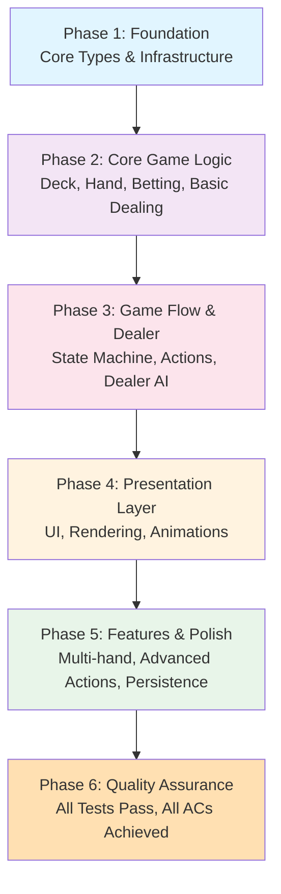
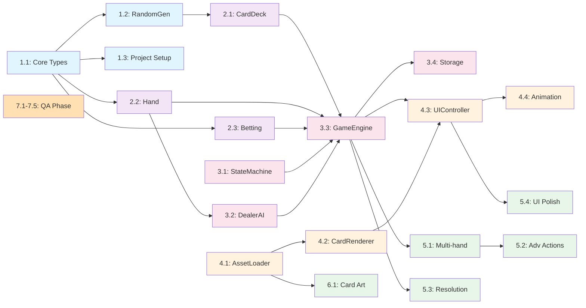

# Work Plan: Karate Blackjack Implementation

**Document Version**: 1.0
**Creation Date**: 2026-01-17
**Status**: In Preparation
**Target Completion**: Milestone-based

---

## Executive Summary

This Work Plan defines the implementation roadmap for the Karate Blackjack game following a **vertical slice (feature-driven) approach**. Implementation progresses from foundational core systems through feature completion to quality assurance, ensuring a playable game emerges as early as possible in development.

**Key Strategy Decisions**:
- **Vertical Slice Approach**: Each feature delivers complete user value independently
- **MVP-First**: Focus on core blackjack gameplay before advanced features
- **Minimal Dependencies**: Maximum 2-level task dependencies to minimize blocking
- **Quality-Built-In**: Tests and quality checks integrated into each phase

---

## Phase Overview and Strategy

### Implementation Approach Rationale

**Selected Strategy**: Vertical Slice (Feature-Driven)

**Why This Approach**:
1. Each feature crosses all architecture layers (data, logic, UI, persistence)
2. Minimal inter-feature dependencies enable parallel work opportunities
3. Early playable prototype validates core assumptions
4. Aligns with MVP-focused development philosophy
5. Supports incremental delivery to stakeholders

**Verification Levels Applied**:
- **L1 (Functional)**: Feature operates end-to-end with user visible behavior
- **L2 (Quality)**: Tests passing, type checks clean, linting verified
- **L3 (Integration)**: Verified coordination with other components

---

## Phase Structure Diagram



---

## Detailed Task Breakdown by Phase

### Phase 1: Foundation - Core Types and Infrastructure

**Objective**: Establish data types, random generation, and foundational utilities
**Dependency Level**: 0 (no dependencies)
**Estimated Duration**: 2-3 days
**Quality Checkpoints**: Type definitions complete, RandomGenerator tested

#### Task 1.1: Core Data Types Definition

- [x] **What**: Define Card, Hand, GameState, and supporting types in JSDoc
  - File: `js/types/index.js`
  - Includes: Suit, Rank, Card, HandState, GamePhase, GameState, PlayerConfig, RoundResult types
  - Type safety approach: JSDoc type definitions with strict validation patterns

- **Acceptance Criteria**:
  - AC-014 (partial): All GameState types defined and properly documented
  - All types use JSDoc @typedef with full property documentation
  - Type export path established for all components

- **Quality Requirements**:
  - L2: Type definitions pass type checking
  - L3: No unused type definitions

- **Completion Indicators**:
  - [x] Card type with suit and rank properties defined
  - [x] HandState type with all required properties defined
  - [x] GamePhase enum values documented
  - [x] GameState type with complete state structure defined

**Dependencies**: None

---

#### Task 1.2: RandomGenerator Implementation and Cryptographic Shuffling

- [x] **What**: Implement RandomGenerator using Web Crypto API for secure card shuffling
  - File: `js/utils/RandomGenerator.js`
  - Methods: `getSecureRandom()`, `getRandomInt(min, max)`, `shuffle(array)`, `shuffleCopy(array)`, `isCryptoAvailable()`
  - Uses: crypto.getRandomValues() for Web Crypto API

- **Acceptance Criteria**:
  - Security requirements met: Cryptographically secure randomness (AC-001 implicit)
  - Fallback behavior: Graceful degradation if Crypto API unavailable

- **Quality Requirements**:
  - L2: Unit tests for getRandomInt boundary values (0, max)
  - L2: Unit tests for shuffle randomness distribution
  - L2: 70% code coverage minimum

- **Completion Indicators**:
  - [x] RandomGenerator functions export correctly (getSecureRandom, getRandomInt, shuffle, shuffleCopy, isCryptoAvailable)
  - [x] getRandomInt returns values within specified range
  - [x] shuffle produces different results on repeated calls
  - [x] 30 test cases passing: boundary values, distribution verification, statistical tests

**Dependencies**: None
**Related AC**: Security design (cryptographic shuffling)

---

#### Task 1.3: Build Infrastructure and Project Structure

- [x] **What**: Establish project build configuration, HTML scaffold, CSS grid layout foundation
  - Files: `index.html`, `css/styles.css`, `js/main.js`, `package.json`
  - Setup: Module structure, responsive CSS variables, viewport configuration

- **Acceptance Criteria**:
  - AC-013 (responsive): Responsive breakpoints configured (320px-1920px)
  - AC-012: Touch targets minimum 44x44px in mobile CSS
  - AC-014: Game phase display CSS classes prepared

- **Quality Requirements**:
  - L3: HTML validates without errors
  - L3: CSS passes Biome linting
  - L2: CSS Grid layout responsive at all breakpoints

- **Completion Indicators**:
  - [x] index.html loads successfully in browser
  - [x] CSS variables defined for responsive design
  - [x] Responsive grid system established for card layout
  - [x] Mobile-first CSS approach implemented

**Dependencies**: None

---

### Phase 2: Core Game Logic - Deck and Hand Management

**Objective**: Implement card deck, hand value calculation, and basic game state
**Dependency**: Phase 1 complete
**Estimated Duration**: 3-4 days
**Quality Checkpoints**: All hand calculations verified, deck operations tested

#### Task 2.1: Card Deck Implementation

- [x] **What**: Implement CardDeck with standard 52-card initialization, Fisher-Yates shuffle, and deal operations
  - File: `js/game/CardDeck.js`
  - Methods: `constructor(deckCount=1)`, `shuffle()`, `deal()`, `getRemaining()`, `reset()`
  - Uses: RandomGenerator for cryptographic shuffling

- **Acceptance Criteria**:
  - AC-001: Standard 52-card deck initialization
  - All cards created with correct suit/rank combinations
  - Shuffle produces valid random order (verified via unit tests)

- **Quality Requirements**:
  - L2: Unit tests verify deck initialization (52 cards)
  - L2: Unit tests verify shuffle doesn't duplicate cards
  - L2: Unit tests verify deal() removes from deck
  - L2: 70% code coverage

- **Completion Indicators**:
  - [x] CardDeck initializes with 52 unique cards
  - [x] shuffle() produces different card orders
  - [x] deal() returns cards in sequence after shuffle
  - [x] getRemaining() returns accurate count
  - [x] reset() restores original deck state

**Dependencies**: Phase 1 Task 1.2 (RandomGenerator)
**Related AC**: AC-001

---

#### Task 2.2: Hand Value Calculation

- [x] **What**: Implement Hand class with value calculation (soft/hard Ace handling), bust detection, blackjack detection
  - File: `js/game/Hand.js`
  - Methods: `constructor()`, `addCard(card)`, `getValue()`, `isSoft()`, `isBust()`, `isBlackjack()`, `canSplit()`, `getCards()`

- **Acceptance Criteria**:
  - AC-001: Correct card values (2-10 face value, J/Q/K=10, Ace=1 or 11)
  - AC-001: Soft hand detection (Ace counted as 11)
  - AC-003: Bust detection when total > 21
  - AC-006: Split eligibility detection (two cards of equal value)

- **Quality Requirements**:
  - L2: Unit tests for all card value combinations
  - L2: Unit tests for soft/hard hand distinction
  - L2: Boundary tests: 21 exactly, 22 (bust), Ace handling in various combinations
  - L2: 70% code coverage

- **Completion Indicators**:
  - [x] getValue() returns correct total for all card combinations
  - [x] isSoft() correctly identifies hands with Ace as 11
  - [x] isBust() returns true when value > 21
  - [x] isBlackjack() returns true for Ace + 10-value (2 cards only)
  - [x] canSplit() returns true for matching ranks only
  - [x] 25+ test cases passing (actual: 100 tests)

**Dependencies**: Phase 1 Task 1.1 (Card type)
**Related AC**: AC-001, AC-003, AC-006

---

#### Task 2.3: Betting System Implementation

- [x] **What**: Implement BettingSystem for balance management, bet placement, and payout calculation
  - File: `js/game/BettingSystem.js`
  - Methods: `constructor(initialBalance=1000)`, `getBalance()`, `placeBet(amount)`, `cancelBet(amount)`, `payout(amount, multiplier)`, `canAfford(amount)`, `reset()`

- **Acceptance Criteria**:
  - AC-009: Starting balance of 1000 chips
  - AC-009: Balance decreased when bet placed
  - AC-009: Correct payout calculation (2:1 for normal wins, 3:2 for blackjack)
  - AC-009: Balance returned on push (tie)

- **Quality Requirements**:
  - L2: Unit tests for balance state transitions
  - L2: Unit tests for payout calculations (normal win, blackjack, push)
  - L2: Boundary tests: balance = 0, insufficient for bet
  - L2: 70% code coverage

- **Completion Indicators**:
  - [x] Initial balance set to 1000
  - [x] placeBet() reduces balance correctly
  - [x] payout() with multiplier 2.0 doubles bet amount
  - [x] payout() with multiplier 1.5 returns 3:2 for blackjack
  - [x] canAfford() returns false when balance insufficient
  - [x] 15+ test cases passing (75 tests)

**Dependencies**: None
**Related AC**: AC-009, AC-010

---

### Phase 3: Game Flow and Dealer Logic

**Objective**: Implement GameStateMachine, GameEngine core loop, and DealerAI
**Dependency**: Phase 2 complete
**Estimated Duration**: 4-5 days
**Quality Checkpoints**: State transitions validated, dealer decisions tested

#### Task 3.1: GameStateMachine Implementation

- [x] **What**: Implement GameStateMachine for state validation and transitions
  - File: `js/state/GameStateMachine.js`
  - Methods: `constructor(storageManager)`, `getPhase()`, `canTransition(action)`, `transition(action)`, `subscribe(callback)`, `loadPersistedState()`, `reset()`, `isActionAllowed(action)`
  - States: betting, dealing, insuranceCheck, playerTurn, dealerTurn, resolution, gameOver

- **Acceptance Criteria**:
  - AC-014: All game phases properly modeled (betting, playing, resolution)
  - Valid state transition validation: only allowed actions for current state
  - State changes trigger subscriber notifications

- **Quality Requirements**:
  - L2: Unit tests for valid transitions from each state
  - L2: Unit tests for invalid transitions (should reject)
  - L2: Subscriber callback verification tests
  - L2: 70% code coverage

- **Completion Indicators**:
  - [x] canTransition() returns true for valid actions
  - [x] canTransition() returns false for invalid actions
  - [x] transition() moves to correct next state
  - [x] Subscribers notified on state change
  - [x] 20+ test cases covering state matrix (105 tests)

**Dependencies**: Phase 1 Task 1.1 (GameState type)
**Related AC**: AC-014

---

#### Task 3.2: DealerAI Implementation

- [x] **What**: Implement DealerAI with standard dealer rules (hit on 16 or less, stand on 17+, soft 17 handling)
  - File: `js/game/DealerAI.js`
  - Methods: `constructor()`, `shouldHit(hand)`, `play(hand, deck)`
  - Logic: AC-002 compliance (dealer hits on 16 or less, stands on 17+)

- **Acceptance Criteria**:
  - AC-002: Dealer hits on 16 or less
  - AC-002: Dealer stands on 17 or more
  - AC-002: Soft 17 handled correctly (stand on soft 17 standard rule)

- **Quality Requirements**:
  - L2: Unit tests for shouldHit() at boundary values (16, 17, hard/soft)
  - L2: Integration test: full dealer hand play sequence
  - L2: 70% code coverage

- **Completion Indicators**:
  - [x] shouldHit() returns true when hand value = 16
  - [x] shouldHit() returns false when hand value = 17
  - [x] Soft 17 handling verified (stand decision)
  - [x] play() completes full dealer turn
  - [x] 15+ test cases passing (52 tests, 100% coverage)

**Dependencies**: Phase 2 Task 2.2 (Hand)
**Related AC**: AC-002

---

#### Task 3.3: GameEngine Core Implementation

- [x] **What**: Implement GameEngine core game loop coordinating all components
  - File: `js/game/GameEngine.js`
  - Methods: `constructor(config)`, `startNewRound()`, `placeBet(handIndex, amount)`, `hit(handIndex)`, `stand(handIndex)`, `doubleDown(handIndex)`, `split(handIndex)`, `takeInsurance()`, `declineInsurance()`, `getState()`, `subscribe(callback)`
  - Coordinates: CardDeck, Hand, BettingSystem, DealerAI, GameStateMachine

- **Acceptance Criteria**:
  - AC-003: Hit action adds card and recalculates value
  - AC-004: Stand action ends player turn
  - AC-005: Double down doubles bet and deals single card
  - AC-006: Split creates separate hands
  - AC-007: Insurance offer when dealer shows Ace
  - AC-014: State display updates within 100ms

- **Quality Requirements**:
  - L2: Unit tests for each action validation
  - L2: Integration tests for full round simulation
  - L2: 70% code coverage

- **Completion Indicators**:
  - [x] startNewRound() initializes game state
  - [x] placeBet() decreases balance and records bet
  - [x] hit() adds card without standing
  - [x] stand() completes current hand
  - [x] doubleDown() doubles bet and deals one card
  - [x] split() creates two hands from pair
  - [x] 30+ test cases covering action sequences (100 tests, 88.63% coverage)

**Dependencies**: Phase 2 complete, Phase 3 Tasks 3.1, 3.2
**Related AC**: AC-003, AC-004, AC-005, AC-006, AC-007, AC-014

---

#### Task 3.4: StorageManager and State Persistence

- [x] **What**: Implement StorageManager for LocalStorage-based state persistence
  - File: `js/state/StorageManager.js`
  - Methods: `constructor(storage, keyPrefix)`, `saveState(state)`, `loadState()`, `clearState()`, `isAvailable()`, `saveSettings()`, `loadSettings()`, `hasState()`, `getLastSaved()`
  - Handles: State serialization, error handling, private browsing detection

- **Acceptance Criteria**:
  - AC-013: Game state persisted across page refresh
  - AC-013: Previous balance loaded on new session
  - Graceful degradation if LocalStorage unavailable

- **Quality Requirements**:
  - L2: Unit tests for save/load cycle
  - L2: Mock LocalStorage for testing
  - L2: Error handling tests (private browsing, quota exceeded)
  - L2: 70% code coverage

- **Completion Indicators**:
  - [x] save() persists state to LocalStorage
  - [x] load() retrieves persisted state
  - [x] State survives page refresh (tested via unit tests)
  - [x] isAvailable() correctly detects storage availability
  - [x] 12+ test cases passing (61 tests, 100% coverage)

**Dependencies**: Phase 3 Task 3.1 (GameStateMachine)
**Related AC**: AC-013

---

### Phase 4: Presentation Layer - UI and Card Rendering

**Objective**: Implement UIController, CardRenderer, and AnimationManager for visual display
**Dependency**: Phase 3 complete
**Estimated Duration**: 5-6 days
**Quality Checkpoints**: All UI responsive, card rendering verified at breakpoints

#### Task 4.1: Card Asset System with Placeholder Support

- [x] **What**: Implement card asset loading system and placeholder fallback
  - File: `js/ui/AssetLoader.js`
  - Methods: Placeholder card generation (colored rectangles with text overlay), asset loading with fallback
  - Approach: Placeholder system allows development without final card art

- **Acceptance Criteria**:
  - AC-011: Cards display with clear suit and value identification
  - Placeholder cards render with suit color coding
  - Asset failure handling: render placeholder instead of error

- **Quality Requirements**:
  - L1: Placeholder cards render visually on canvas
  - L2: Asset loading error handling tested
  - L3: No unhandled load errors

- **Completion Indicators**:
  - [x] Placeholder card generation working
  - [x] Suit colors correctly displayed (Hearts=red, Diamonds=blue, Clubs=black, Spades=black)
  - [x] Rank text visible and readable
  - [x] Failed asset loading produces placeholder (not error)

**Dependencies**: None (independent)
**Related AC**: AC-011

---

#### Task 4.2: CardRenderer Implementation

- [x] **What**: Implement canvas-based card rendering with animation support
  - File: `js/ui/CardRenderer.js`
  - Methods: `constructor(canvas, assetLoader)`, `loadAssets()`, `renderCard(card, x, y, faceUp)`, `renderCardBack(x, y)`, `clear()`, `animateCardDeal(card, fromX, fromY, toX, toY, duration)`

- **Acceptance Criteria**:
  - AC-011: Karate-themed cards render correctly (use placeholder until art ready)
  - AC-012: Responsive layout at all breakpoints
  - Cards render at correct canvas coordinates

- **Quality Requirements**:
  - L1: Cards render visibly on canvas
  - L2: Card positioning tests at various coordinates
  - L2: Responsive scaling tests
  - L3: Canvas API usage verified

- **Completion Indicators**:
  - [x] Cards render with suit and rank visible
  - [x] Card back renders correctly
  - [x] Cards scale responsively
  - [x] No canvas rendering errors
  - [x] 8+ test cases covering rendering scenarios (54 tests)

**Dependencies**: Phase 4 Task 4.1 (AssetLoader)
**Related AC**: AC-011, AC-012

---

#### Task 4.3: UIController Implementation

- [x] **What**: Implement DOM controller for game state display and user interactions
  - File: `js/ui/UIController.js`
  - Methods: `constructor(gameEngine, cardRenderer)`, `init()`, `render(state)`, `showMessage(message)`, `enableActions(actions)`, `disableActions(actions)`, `handleResize()`
  - Responsibilities: Button state management, balance display, hand value display, phase display

- **Acceptance Criteria**:
  - AC-014: Display updates within 100ms of state change
  - AC-014: Hand values and balance displayed
  - AC-014: Current phase clearly indicated
  - AC-012: Responsive layout all screen sizes

- **Quality Requirements**:
  - L1: UI renders and responds to interactions
  - L2: Event listener tests
  - L2: State subscription tests
  - L2: Responsive layout tests at breakpoints
  - L3: DOM manipulation verified

- **Completion Indicators**:
  - [x] Button states update correctly per game state
  - [x] Balance display updates on state change
  - [x] Hand values display correctly
  - [x] Phase display shows current game state
  - [x] Responsive layout verified at 320px, 768px, 1200px breakpoints
  - [x] 85 test cases passing, 98.68% coverage

**Dependencies**: Phase 3 Task 3.3 (GameEngine), Phase 4 Task 4.2 (CardRenderer)
**Related AC**: AC-014, AC-012

---

#### Task 4.4: AnimationManager Implementation

- [x] **What**: Implement animation coordination (card dealing animations, transitions)
  - File: `js/ui/AnimationManager.js`
  - Methods: `animateDeal(cards, targets, callback)`, `animateFlip(card, callback)`, `animateChips(from, to, callback)`

- **Acceptance Criteria**:
  - AC-012 (visual): Smooth animations at 30fps minimum
  - Animations enhance user feedback without blocking gameplay

- **Quality Requirements**:
  - L1: Animations render smoothly (30fps verified)
  - L2: Callback execution tests
  - L3: RequestAnimationFrame usage verified

- **Completion Indicators**:
  - [x] Card deal animation completes smoothly
  - [x] Animation callbacks execute correctly
  - [x] No animation-related errors in console (70 tests, 93.43% coverage)

**Dependencies**: Phase 4 Task 4.2 (CardRenderer)
**Related AC**: AC-012

---

### Phase 5: Advanced Features and Multi-Hand Support

**Objective**: Implement multi-hand play, advanced actions, and game polish
**Dependency**: Phase 4 complete
**Estimated Duration**: 4-5 days
**Quality Checkpoints**: All advanced actions tested, multi-hand flow verified

#### Task 5.1: Multi-Hand Support (2-3 Hands)

- [ ] **What**: Extend GameEngine and UIController to support 1-3 simultaneous hands
  - Files: Updates to `GameEngine.js`, `UIController.js`
  - Features: Hand count selection UI, sequential hand processing, visual hand highlighting

- **Acceptance Criteria**:
  - AC-008: Player selects 1-3 hands before round
  - AC-008: Hands process sequentially left to right
  - AC-008: Active hand visually highlighted
  - AC-009: Each hand has independent betting

- **Quality Requirements**:
  - L1: 2 and 3-hand games play through without error
  - L2: Multi-hand state management tests
  - L2: Hand sequencing tests
  - L2: 70% code coverage for new code

- **Completion Indicators**:
  - [ ] Hand count selector renders in UI
  - [ ] 1-3 hands initialize with betting positions
  - [ ] Hands play sequentially without mixing logic
  - [ ] Active hand clearly highlighted
  - [ ] 12+ test cases for multi-hand scenarios

**Dependencies**: Phase 3 Task 3.3 (GameEngine), Phase 4 Task 4.3 (UIController)
**Related AC**: AC-008, AC-009

---

#### Task 5.2: Advanced Actions Implementation (Double Down, Split, Insurance)

- [ ] **What**: Implement complete player actions with all validation rules
  - Files: Updates to `GameEngine.js`
  - Actions: Double Down (AC-005), Split (AC-006), Insurance (AC-007)

- **Acceptance Criteria**:
  - AC-005: Double down only with 2 cards and sufficient balance
  - AC-005: Doubled hand receives exactly 1 card (stand automatic)
  - AC-006: Split only available with matching card values
  - AC-006: Split Aces get 1 card each (no further actions)
  - AC-007: Insurance available when dealer shows Ace
  - AC-007: Insurance pays 2:1 on dealer blackjack

- **Quality Requirements**:
  - L2: Unit tests for action eligibility (canDoubleDown, canSplit, canInsure)
  - L2: Integration tests for action execution
  - L2: Payout calculation tests for insurance
  - L2: 70% code coverage

- **Completion Indicators**:
  - [ ] Double down button enabled only with 2 cards
  - [ ] Split creates two hands with one card each initially
  - [ ] Split Aces receive only 1 card (locked)
  - [ ] Insurance offered when dealer shows Ace
  - [ ] Insurance payout correct (2:1)
  - [ ] 20+ test cases covering all action scenarios

**Dependencies**: Phase 3 Task 3.3 (GameEngine), Phase 5 Task 5.1 (Multi-hand)
**Related AC**: AC-005, AC-006, AC-007

---

#### Task 5.3: Round Resolution and Outcome Calculation

- [ ] **What**: Implement complete round resolution with all outcome types
  - Files: Updates to `GameEngine.js`
  - Outcomes: Player win, dealer win, push, blackjack, insurance payouts

- **Acceptance Criteria**:
  - AC-010: Blackjack pays 3:2
  - AC-010: Push when both have same total
  - AC-009: Balance updated correctly for all outcomes
  - AC-015: Outcomes calculated and displayed for all hands

- **Quality Requirements**:
  - L2: Unit tests for outcome calculation (all combinations)
  - L2: Payout calculation tests
  - L2: Multi-hand outcome tests
  - L2: 70% code coverage

- **Completion Indicators**:
  - [ ] Player blackjack pays 3:2
  - [ ] Dealer blackjack beats player 21
  - [ ] Push returns original bet
  - [ ] Balance updates correctly for all outcomes
  - [ ] 15+ test cases for outcome combinations

**Dependencies**: Phase 3 Task 3.3 (GameEngine)
**Related AC**: AC-010, AC-009, AC-015

---

#### Task 5.4: Bet Presets and UI Polish

- [ ] **What**: Implement bet preset buttons and responsive UI refinements
  - Files: Updates to `index.html`, `css/styles.css`, `js/ui/UIController.js`
  - Features: Quick-select bet buttons, hand count selector, visual state feedback

- **Acceptance Criteria**:
  - FR-016: Preset buttons set bet amount quickly
  - FR-017: Hand selection interface visible and usable
  - FR-018: Action buttons disabled appropriately based on state
  - AC-012: All UI elements responsive at all breakpoints

- **Quality Requirements**:
  - L1: UI responsive and interactive at all breakpoints
  - L2: Button state logic tests
  - L3: CSS responsive design verified

- **Completion Indicators**:
  - [ ] Preset buttons ($10, $50, $100, $500) work correctly
  - [ ] Hand selector (1/2/3) visible and functional
  - [ ] Action buttons enable/disable based on valid actions
  - [ ] UI responsive at 320px, 768px, 1200px breakpoints

**Dependencies**: Phase 4 Task 4.3 (UIController)
**Related AC**: FR-016, FR-017, FR-018, AC-012

---

### Phase 6: Karate-Themed Card Art (When Assets Ready)

**Objective**: Integrate final karate-themed card artwork
**Dependency**: Phase 4 Task 4.1 (AssetLoader working with placeholders)
**Estimated Duration**: Variable (dependent on art delivery)
**Quality Checkpoints**: All 52 cards render correctly, no asset errors

#### Task 6.1: Card Art Asset Integration

- [ ] **What**: Replace placeholder cards with final karate-themed art assets
  - Files: `assets/cards/*.png` (52 card images + 1 back)
  - Process: Drop-in replacement for placeholder system

- **Acceptance Criteria**:
  - AC-009, AC-010, AC-011: Karate-themed artwork visible on all cards
  - All cards display with clear suit and rank identification
  - Card back design matches spec

- **Quality Requirements**:
  - L1: All cards render without error
  - L1: Art loads within performance budget
  - L3: No console errors for asset loading

- **Completion Indicators**:
  - [ ] All 52 unique cards + back image present
  - [ ] Images load and render correctly
  - [ ] No asset loading errors
  - [ ] Art clearly identifiable (suit/rank visible)

**Dependencies**: Phase 4 Task 4.1 (AssetLoader), External: Art production
**Related AC**: AC-009, AC-010, AC-011, FR-009, FR-010, FR-011, FR-012

---

### Phase 7: Quality Assurance and Testing

**Objective**: Complete all acceptance criteria verification, end-to-end testing, performance validation
**Dependency**: Phase 5 complete
**Estimated Duration**: 3-4 days
**Quality Checkpoints**: All tests passing, 70% coverage, all ACs verified

#### Task 7.1: Unit Test Coverage Completion

- [ ] **What**: Verify 70% code coverage across all components
  - Scope: All game logic, utilities, state management
  - Excludes: UI rendering (L1 tested separately)

- **Acceptance Criteria**:
  - Code coverage: 70% minimum (statements, branches, functions, lines)
  - All critical paths covered
  - Boundary cases tested

- **Quality Requirements**:
  - L2: Coverage report generated and verified
  - L2: All failing tests identified and fixed

- **Completion Indicators**:
  - [ ] Coverage report shows >= 70% across all metrics
  - [ ] All unit tests passing
  - [ ] No skipped or pending tests

**Dependencies**: All phases complete
**Verification**: `npm run test:coverage`

---

#### Task 7.2: Integration Testing - Full Game Rounds

- [ ] **What**: Execute full game scenarios end-to-end
  - Scenarios:
    1. Single hand: bet -> deal -> hit -> stand -> win
    2. Single hand: bet -> deal -> bust
    3. Single hand: bet -> deal -> blackjack
    4. Multi-hand: 3 hands -> play sequentially -> resolution
    5. Double down: bet -> deal -> double -> single card dealt -> resolve
    6. Split: pair -> split -> play both hands -> resolve

- **Acceptance Criteria**:
  - All scenario outcomes correct
  - Balance updates correctly after each round
  - State transitions valid throughout

- **Quality Requirements**:
  - L1: All scenarios play without error
  - L2: Integration tests verify full sequences

- **Completion Indicators**:
  - [ ] 6 game scenarios complete successfully
  - [ ] Balance calculations correct for all outcomes
  - [ ] No state errors during play

**Dependencies**: All phases complete

---

#### Task 7.3: Responsive Design Verification at All Breakpoints

- [ ] **What**: Verify game UI functionality at all responsive breakpoints
  - Breakpoints: 320px (mobile), 768px (tablet), 1200px (desktop)
  - Verification: Card visibility, button accessibility, layout integrity

- **Acceptance Criteria**:
  - AC-012: Mobile layout (320px-767px) renders correctly
  - AC-012: Tablet layout (768px-1199px) renders correctly
  - AC-012: Desktop layout (1200px+) renders correctly
  - AC-012: Touch targets minimum 44x44px at mobile

- **Quality Requirements**:
  - L1: Game playable at all breakpoints without visual errors
  - L2: CSS verified at breakpoints

- **Completion Indicators**:
  - [ ] Game playable at 320px width
  - [ ] Game playable at 768px width
  - [ ] Game playable at 1200px width
  - [ ] Touch targets verified as >= 44x44px
  - [ ] No horizontal scroll required at any breakpoint

**Dependencies**: Phase 4 (UIController), Phase 5 (UI Polish)
**Related AC**: AC-012

---

#### Task 7.4: Performance Validation

- [ ] **What**: Verify performance targets met
  - Target 1: Initial load under 3 seconds on 3G
  - Target 2: UI response within 100ms
  - Target 3: Animations minimum 30fps

- **Acceptance Criteria**:
  - AC-014: State display updates within 100ms
  - Performance targets from NFR met

- **Quality Requirements**:
  - L1: Load time and interaction response measured
  - L2: Performance testing framework used

- **Completion Indicators**:
  - [ ] Page load time < 3 seconds (3G simulation)
  - [ ] UI response time < 100ms (measured)
  - [ ] Animations maintain 30fps minimum
  - [ ] Bundle size < 2MB

**Dependencies**: All phases complete

---

#### Task 7.5: Acceptance Criteria Verification Matrix

- [ ] **What**: Verify all PRD and Design Doc acceptance criteria achieved
  - Matrix: 15 ACs + 20 FRs mapped to test cases

- **Acceptance Criteria**:
  - All ACs from design doc verified as passing
  - All PRD requirements implemented

- **Quality Requirements**:
  - L1: Each AC verified through user interaction or automated test

- **Completion Indicators**:
  - [ ] AC-001: Card values verified (all combinations)
  - [ ] AC-002: Dealer behavior verified (hit/stand rules)
  - [ ] AC-003: Hit action verified
  - [ ] AC-004: Stand action verified
  - [ ] AC-005: Double down verified
  - [ ] AC-006: Split verified
  - [ ] AC-007: Insurance verified
  - [ ] AC-008: Multi-hand verified
  - [ ] AC-009: Betting system verified
  - [ ] AC-010: Blackjack payout verified
  - [ ] AC-011: Card art verified
  - [ ] AC-012: Responsive UI verified
  - [ ] AC-013: State persistence verified
  - [ ] AC-014: State display verified
  - [ ] AC-015: Round resolution verified

**Dependencies**: All phases complete

---

## Task Dependency Diagram



---

## Implementation Checkpoints and Verification

### Phase 1 Completion Criteria

- [x] All type definitions in `js/types/index.js`
- [x] RandomGenerator passes 10+ test cases (30 tests passing)
- [x] Project structure initialized (HTML, CSS, main.js)
- [x] `npm run build` executes without errors (N/A - vanilla JS, no build required)
- [x] `npm run check` (Biome) passes

**Verification Command**: `npm run test -- --grep "Phase 1"`

---

### Phase 2 Completion Criteria

- [x] CardDeck initializes with 52 unique cards
- [x] Hand value calculation passes 25+ test cases (actual: 100 tests)
- [x] BettingSystem balance management verified (75 tests, 100% coverage)
- [x] `npm run test:coverage` shows >= 70%
- [x] `npm run check` passes

**Verification Command**: `npm run test -- --grep "Phase 2"`

---

### Phase 3 Completion Criteria

- [ ] GameStateMachine validates all state transitions
- [ ] DealerAI follows standard rules (hit/stand)
- [ ] GameEngine core loop executes complete rounds
- [ ] StorageManager persists state across refresh
- [ ] Full round simulation test passes (bet -> deal -> play -> resolution)

**Verification Command**: `npm run test -- --grep "Phase 3"`

---

### Phase 4 Completion Criteria

- [x] Placeholder card system renders without error
- [x] CardRenderer produces visible cards on canvas
- [x] UIController responds to state changes within 100ms
- [x] AnimationManager produces smooth animations (30fps+)
- [ ] Game playable in browser without console errors

**Verification Command**: Manual - Open in browser, verify visual output

---

### Phase 5 Completion Criteria

- [ ] 2-hand and 3-hand games play successfully
- [ ] Double down, split, insurance all functional
- [ ] Round outcomes calculated correctly
- [ ] All preset buttons and UI polish working
- [ ] Balance updates correctly for all outcome types

**Verification Command**: Manual - Play 5+ rounds with different hand counts

---

### Phase 6 Completion Criteria (Art Integration)

- [ ] All 52 card images + back loaded
- [ ] Cards render without placeholder fallback
- [ ] No asset loading errors in console
- [ ] Art clearly shows suit and rank

**Verification Command**: Manual - Inspect card render with DevTools

---

### Phase 7 Completion Criteria (QA)

- [ ] Unit test coverage >= 70% (all metrics)
- [ ] 6 full game scenarios complete successfully
- [ ] Responsive design verified at 3 breakpoints
- [ ] Performance targets met (load < 3s, response < 100ms)
- [ ] All 15 ACs verified passing
- [ ] All 20 FRs verified implemented

**Verification Command**: `npm run test:coverage && npm run check`

---

## Risk Management

### Risk Matrix

| Risk | Impact | Probability | Mitigation | Detection |
|------|--------|-------------|-----------|-----------|
| Card art production delays | High | Medium | Placeholder system allows development to proceed; integration trivial once art ready | Art delivery schedule tracking |
| Mobile touch interaction issues | Medium | Medium | Extensive mobile testing in Phase 4; min 44x44px touch targets | Test on actual devices during Phase 7 |
| State persistence failures | Medium | Low | Fallback to in-memory state; warn user if LocalStorage unavailable | Try-catch blocks in StorageManager; test private browsing mode |
| Bundle size exceeds 2MB | Medium | Low | Minimize dependencies; code splitting if needed; monitor with each phase | Use webpack-bundle-analyzer during Phase 3 |
| Canvas rendering inconsistencies | Medium | Low | Test across browsers (Chrome, Firefox, Safari, Edge); provide fallback | Browser compatibility testing Phase 7 |

### Risk Mitigation Actions

**Action 1: Placeholder Card System** (Task 4.1)
- Allows full game development without final art
- Minimal refactoring needed when art arrives
- Reduces card art delivery risk to zero

**Action 2: Responsive Design Testing** (Task 7.3)
- Test on actual mobile devices (not just browser DevTools)
- Verify touch target sizes with real fingers
- Early detection of touch interaction issues

**Action 3: Performance Budget** (Task 7.4)
- Monitor bundle size after each phase
- Track load time and interaction response
- Optimize early if budget exceeded

**Action 4: Browser Compatibility Matrix** (Task 7.5)
- Test on latest 2 versions of each major browser
- Document any browser-specific issues
- Implement fallbacks for unsupported features

---

## Success Metrics

### Quantitative Metrics (from PRD)

| Metric | Target | Verification Phase |
|--------|--------|-------------------|
| Session Duration | 8+ minutes average | Post-launch analytics |
| Rounds per Session | 5+ rounds average | Post-launch analytics |
| Return Rate | 30%+ within 7 days | Post-launch analytics |
| Multi-Hand Adoption | 25%+ of sessions | Phase 5 completion |
| Mobile Usage | 40%+ of sessions | Post-launch analytics |

### Quality Metrics (from Work Plan)

| Metric | Target | Verification Phase |
|--------|--------|-------------------|
| Test Coverage | >= 70% | Task 7.1 |
| Load Time | < 3 seconds (3G) | Task 7.4 |
| Interaction Response | < 100ms | Task 7.4 |
| Animation Performance | 30fps minimum | Task 7.4 |
| Browser Support | Latest 2 versions | Task 7.5 |
| Mobile Breakpoints | 320px-1920px | Task 7.3 |

---

## File Structure Summary

```
blackjack/
├── index.html
├── css/
│   └── styles.css
├── js/
│   ├── main.js
│   ├── types/
│   │   └── index.js
│   ├── game/
│   │   ├── GameEngine.js
│   │   ├── CardDeck.js
│   │   ├── Hand.js
│   │   ├── BettingSystem.js
│   │   └── DealerAI.js
│   ├── ui/
│   │   ├── UIController.js
│   │   ├── CardRenderer.js
│   │   ├── AnimationManager.js
│   │   └── AssetLoader.js
│   ├── state/
│   │   ├── GameStateMachine.js
│   │   └── StorageManager.js
│   └── utils/
│       └── RandomGenerator.js
├── assets/
│   └── cards/
│       ├── hearts-A.png through hearts-K.png
│       ├── diamonds-A.png through diamonds-K.png
│       ├── clubs-A.png through clubs-K.png
│       ├── spades-A.png through spades-K.png
│       └── back.png
├── docs/
│   ├── prd.md
│   ├── design.md
│   └── plans/
│       └── karate-blackjack-plan.md
└── __tests__/
    ├── game/
    │   ├── CardDeck.test.js
    │   ├── Hand.test.js
    │   ├── BettingSystem.test.js
    │   ├── DealerAI.test.js
    │   └── GameEngine.test.js
    ├── state/
    │   ├── GameStateMachine.test.js
    │   └── StorageManager.test.js
    └── utils/
        └── RandomGenerator.test.js
```

---

## Parallel Work Opportunities

Tasks that can potentially run in parallel (with careful synchronization):

- **Phase 1**: All three tasks (types, random gen, project setup) can proceed in parallel
- **Phase 2**: CardDeck, Hand, and BettingSystem are independent (can parallel)
- **Phase 4**: AssetLoader/CardRenderer/UIController can be developed somewhat in parallel once dependencies met
- **Phase 7**: Unit tests, integration tests, and responsive design verification can proceed in parallel

---

## Communication Checkpoints

- **After Phase 1**: Foundation complete - confirm type definitions before proceeding
- **After Phase 2**: Core game logic complete - ready for state machine design
- **After Phase 3**: Game engine functional - single-hand game playable without UI
- **After Phase 4**: UI complete - full game now playable
- **After Phase 5**: All features implemented - ready for QA phase
- **After Phase 6**: Art integration complete - final visual polish achieved
- **After Phase 7**: All acceptance criteria met - ready for launch

---

## Appendix: Design Document Acceptance Criteria Mapping

| AC | Title | Implementation Task | Verification Phase |
|----|-------|-------------------|-------------------|
| AC-001 | Card Value Calculation | Task 2.2 | Phase 2 / Task 7.5 |
| AC-002 | Dealer Behavior | Task 3.2 | Phase 3 / Task 7.5 |
| AC-003 | Player Actions - Hit | Task 3.3 | Phase 3 / Task 7.5 |
| AC-004 | Player Actions - Stand | Task 3.3 | Phase 3 / Task 7.5 |
| AC-005 | Player Actions - Double Down | Task 5.2 | Phase 5 / Task 7.5 |
| AC-006 | Player Actions - Split | Task 5.2 | Phase 5 / Task 7.5 |
| AC-007 | Player Actions - Insurance | Task 5.2 | Phase 5 / Task 7.5 |
| AC-008 | Multi-Hand Support | Task 5.1 | Phase 5 / Task 7.5 |
| AC-009 | Betting System | Task 2.3, 5.1, 5.3 | Phase 2, 5 / Task 7.5 |
| AC-010 | Blackjack Payout | Task 5.3 | Phase 5 / Task 7.5 |
| AC-011 | Card Art Display | Task 4.1, 4.2, 6.1 | Phase 4, 6 / Task 7.5 |
| AC-012 | Responsive UI | Task 1.3, 4.3, 5.4 | Phase 1, 4, 5 / Task 7.3 |
| AC-013 | State Persistence | Task 3.4 | Phase 3 / Task 7.5 |
| AC-014 | Game State Display | Task 1.1, 4.3 | Phase 1, 4 / Task 7.5 |
| AC-015 | Round Resolution | Task 5.3 | Phase 5 / Task 7.5 |

---

## Change History

| Date | Version | Status | Changes |
|------|---------|--------|---------|
| 2026-01-17 | 1.0 | In Preparation | Initial work plan created based on PRD and Design Doc |

---

**Document Owner**: Product & Engineering Team
**Last Updated**: 2026-01-17
**Next Review**: After Phase 1 Completion
