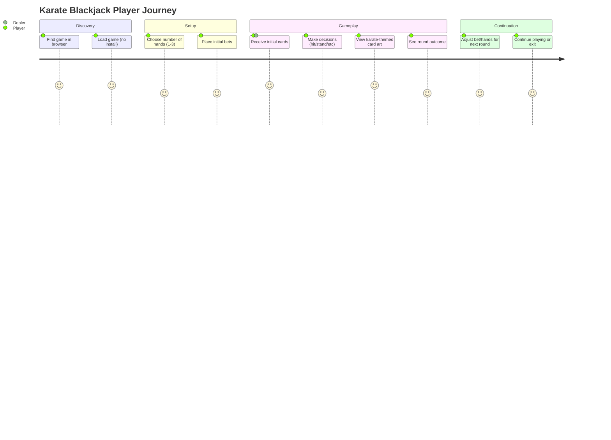
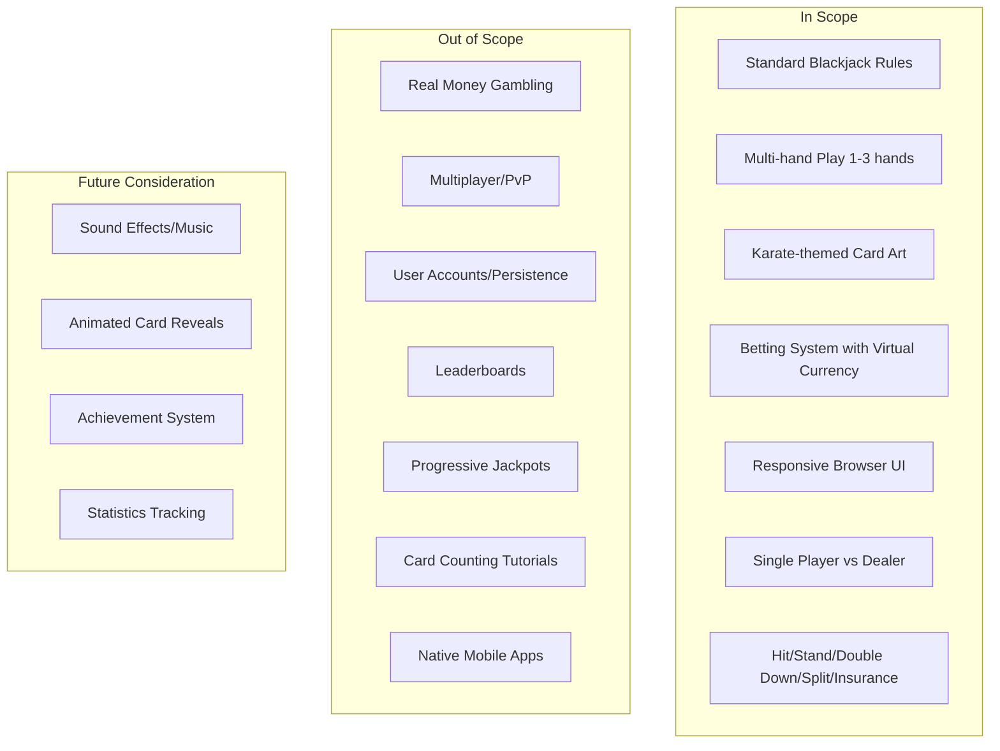

# PRD: Karate Blackjack

## Overview

### One-line Summary
A browser-based blackjack game featuring karate-themed card art with support for multi-hand play (1-3 hands simultaneously).

### Background
Browser-based casual games continue to grow with the market projected to reach USD 0.14 billion by 2035. Card games specifically show strong retention among players, particularly when offering unique themes and accessibility features. This product combines the timeless appeal of blackjack with a distinctive karate theme, creating a visually engaging experience that stands out in the casual gaming market.

The karate theme provides:
- **Differentiation**: Unique visual identity in a crowded card game market
- **Cultural appeal**: Martial arts aesthetics resonate across global audiences
- **Engagement opportunity**: Theme can enhance player immersion through cohesive design

## User Stories

### Primary Users
Casual gamers who enjoy:
- Quick gaming sessions (5-15 minutes)
- Classic card games with visual appeal
- Browser-based games requiring no installation
- Single-player experiences against an AI dealer

### User Stories

```
As a casual gamer
I want to play blackjack in my browser without downloading anything
So that I can enjoy a quick gaming session during breaks
```

```
As a blackjack enthusiast
I want to play multiple hands simultaneously
So that I can increase the action and test different strategies
```

```
As a player who appreciates visual design
I want to see unique karate-themed card artwork
So that the game feels fresh and engaging compared to standard card games
```

```
As a mobile user
I want the game to work on my phone and tablet
So that I can play anywhere without needing a desktop computer
```

### Use Cases
1. **Quick Break Gaming**: Player opens the game during a work break, plays 3-4 rounds with a single hand, and closes the browser
2. **Extended Session**: Player settles in for a longer session, enabling 3-hand play to maximize engagement and test betting strategies
3. **Learning Blackjack**: New player uses the game to learn blackjack rules in a low-pressure environment with visual guidance
4. **Mobile Gaming**: Player accesses the game on their phone during commute, using touch controls for hit/stand decisions

## User Journey Diagram



## Scope Boundary Diagram



## Functional Requirements

### Must Have (MVP)

- [ ] **FR-001**: Standard Blackjack Game Logic
  - Implement complete blackjack rules including card values (2-10 face value, J/Q/K = 10, Ace = 1 or 11)
  - Dealer must hit on 16 or below, stand on 17 or above
  - Natural blackjack pays 3:2
  - AC: Given a standard 52-card deck, when cards are dealt, then card values are calculated correctly and dealer follows standard rules

- [ ] **FR-002**: Player Actions - Hit
  - Player can request additional cards until they bust (exceed 21) or choose to stand
  - AC: When player selects "Hit", then one card is added to their hand and total is recalculated

- [ ] **FR-003**: Player Actions - Stand
  - Player can choose to keep current hand and end their turn
  - AC: When player selects "Stand", then dealer reveals hidden card and plays according to rules

- [ ] **FR-004**: Player Actions - Double Down
  - Player can double their bet and receive exactly one more card
  - Only available on initial two-card hand
  - AC: Given player has initial two cards, when "Double Down" is selected, then bet is doubled and exactly one card is dealt

- [ ] **FR-005**: Player Actions - Split
  - Player can split matching cards into two separate hands
  - Each split hand receives one additional card
  - Split aces receive only one card each
  - AC: Given player has two cards of equal value, when "Split" is selected, then two separate hands are created with independent play

- [ ] **FR-006**: Player Actions - Insurance
  - When dealer shows an Ace, player can place insurance bet (half of original bet)
  - Insurance pays 2:1 if dealer has blackjack
  - AC: Given dealer's face-up card is Ace, when player selects "Insurance", then insurance bet option appears

- [ ] **FR-007**: Multi-Hand Support
  - Player can choose to play 1, 2, or 3 hands simultaneously per round
  - Each hand has independent betting and gameplay
  - AC: When player selects hand count, then that number of hands is dealt and played sequentially

- [ ] **FR-008**: Betting System
  - Virtual currency betting with configurable bet amounts
  - Minimum and maximum bet limits
  - Starting balance provided to player
  - AC: Given player has sufficient balance, when bet is placed, then balance is deducted and potential winnings are calculated

- [ ] **FR-009**: Karate-Themed Card Art - Number Cards
  - All number cards (2-10) display unique karate-themed artwork
  - Designs should incorporate martial arts imagery (stances, equipment, dojo elements)
  - AC: When any number card is displayed, then karate-themed artwork is shown with clear suit and value identification

- [ ] **FR-010**: Karate-Themed Card Art - Face Cards
  - Jack, Queen, King cards feature karate practitioner characters
  - Each suit has distinct character designs
  - AC: When any face card is displayed, then themed character artwork is shown with clear suit and rank identification

- [ ] **FR-011**: Karate-Themed Card Art - Aces
  - Ace cards feature prominent karate symbolism (black belt, dojo crest, etc.)
  - AC: When any Ace is displayed, then themed artwork is shown with clear suit identification

- [ ] **FR-012**: Karate-Themed Card Back Design
  - Unified card back design with karate theme
  - Used for face-down cards
  - AC: When card is face-down, then themed card back design is displayed

- [ ] **FR-013**: Responsive User Interface
  - Game adapts to desktop, tablet, and mobile screen sizes
  - Touch-friendly controls for mobile devices
  - Clear visual hierarchy for game state information
  - AC: Given any screen size from 320px to 1920px width, when game is loaded, then UI elements are properly sized and accessible

- [ ] **FR-014**: Game State Display
  - Show current hand values for player and dealer
  - Display current balance and active bets
  - Clear indication of game phase (betting, playing, resolution)
  - AC: When game state changes, then display updates within 100ms to reflect current state

- [ ] **FR-015**: Round Resolution
  - Calculate and display win/loss/push outcomes
  - Update balance based on round results
  - Enable new round initiation
  - AC: When all hands are complete, then outcomes are calculated correctly and balance is updated

### Should Have

- [ ] **FR-016**: Bet Presets
  - Quick-select buttons for common bet amounts
  - AC: When preset button is clicked, then bet amount is set to that value

- [ ] **FR-017**: Hand Selection Interface
  - Visual selector for choosing 1, 2, or 3 hands before each round
  - AC: When hand count is selected, then game prepares appropriate number of betting positions

- [ ] **FR-018**: Visual Feedback for Actions
  - Highlight available actions based on game state
  - Disable unavailable actions (e.g., no split when cards do not match)
  - AC: Given game state, when actions are displayed, then only valid actions are enabled

### Could Have

- [ ] **FR-019**: Basic Sound Effects
  - Card dealing sounds
  - Win/loss audio feedback
  - AC: When significant game events occur, then appropriate sound plays

- [ ] **FR-020**: Simple Animations
  - Card dealing animation
  - Chip movement animation
  - AC: When cards are dealt, then smooth animation is displayed

### Out of Scope

- **Real Money Gambling**: This is an entertainment-only game with virtual currency. No real money transactions will be supported.
  - Reason: Regulatory complexity and licensing requirements

- **Multiplayer/PvP**: No player-versus-player or shared table functionality
  - Reason: MVP focus on core single-player experience

- **User Accounts**: No login, registration, or persistent user data
  - Reason: Simplify initial release; can be added later

- **Leaderboards**: No competitive ranking or score sharing
  - Reason: Requires backend infrastructure not in MVP scope

- **Native Mobile Apps**: Browser-only experience, no App Store/Play Store releases
  - Reason: Focus on web accessibility; native apps are future consideration

## Non-Functional Requirements

### Performance
- **Initial Load Time**: Page load under 3 seconds on 3G connection
- **Interaction Response**: UI responds to player input within 100ms
- **Animation Frame Rate**: Minimum 30fps for any animations

### Reliability
- **Browser Compatibility**: Support for latest 2 versions of Chrome, Firefox, Safari, and Edge
- **Error Handling**: Graceful degradation if assets fail to load
- **State Recovery**: Game state preserved if page is accidentally refreshed during active round

### Security
- **Client-Side Only**: No sensitive data transmission (virtual currency only)
- **Random Number Generation**: Cryptographically secure randomness for card shuffling

### Scalability
- **Static Hosting**: Game should be deployable to any static file hosting service
- **No Backend Dependencies**: All game logic runs client-side

### Accessibility
- **Color Contrast**: Minimum 4.5:1 contrast ratio for text
- **Touch Targets**: Minimum 44x44px touch targets for mobile
- **Keyboard Navigation**: Full game playable via keyboard

## Success Metrics

### Quantitative Metrics
1. **Session Duration**: Average session length of 8+ minutes
2. **Rounds per Session**: Average of 5+ rounds played per session
3. **Return Rate**: 30%+ of users return within 7 days
4. **Multi-Hand Adoption**: 25%+ of sessions include multi-hand play
5. **Mobile Usage**: 40%+ of sessions from mobile devices

### Qualitative Metrics
1. **Visual Appeal**: Users describe the karate theme as "unique" and "engaging" in feedback
2. **Ease of Use**: New players understand controls within first round
3. **Card Art Recognition**: Players can quickly identify card values and suits from themed artwork

### Measurement Methods
- Session duration and rounds tracked via client-side analytics
- Return rate measured through anonymous browser fingerprinting or local storage
- User feedback collected through optional in-game survey

## Technical Considerations

### Dependencies
- Modern browser with JavaScript enabled
- HTML5 Canvas or SVG support for card rendering
- CSS Grid/Flexbox support for responsive layout

### Constraints
- **Bundle Size**: Total initial download under 2MB (excluding cached assets)
- **Card Art Assets**: 54 unique card images (52 cards + 2 jokers/card back variants)
- **No Third-Party Dependencies**: Minimize external library dependencies for performance

### Assumptions
- Players have stable internet connection for initial load
- Target devices have minimum 2GB RAM
- Players are familiar with basic blackjack rules or willing to learn

### Risks and Mitigation

| Risk | Impact | Probability | Mitigation |
|------|--------|-------------|------------|
| Card art production delays | High | Medium | Define art requirements early; consider placeholder art for development |
| Mobile touch interaction issues | Medium | Medium | Extensive mobile testing; larger touch targets |
| Browser compatibility issues | Medium | Low | Progressive enhancement; polyfills for older browsers |
| Poor performance on low-end devices | Medium | Medium | Optimize assets; provide low-quality mode option |
| Player confusion with multi-hand UI | Medium | Medium | Clear visual separation; sequential hand highlighting |

## Appendix

### References
- [Casual Games Market Trends 2026](https://www.blog.udonis.co/mobile-marketing/mobile-games/casual-games)
- [Browser Games Market Size & Outlook](https://www.businessresearchinsights.com/market-reports/browser-games-market-108675)
- [Future of Browser Gaming 2026](https://browsergameshq.com/the-future-of-browser-gaming-trends-to-watch-in-2026/)
- Standard Blackjack Rules Reference

### Glossary
- **Blackjack**: A hand totaling 21 with exactly two cards (Ace + 10-value card)
- **Bust**: A hand totaling over 21, resulting in automatic loss
- **Double Down**: Doubling the bet and receiving exactly one more card
- **Hit**: Request an additional card
- **Insurance**: Side bet offered when dealer shows Ace, pays 2:1 if dealer has blackjack
- **Push**: Tie between player and dealer; bet is returned
- **Split**: Dividing a pair into two separate hands
- **Stand**: Keep current hand total and end turn
- **Natural**: Another term for blackjack (21 in two cards)
- **Soft Hand**: A hand containing an Ace counted as 11
- **Hard Hand**: A hand with no Ace, or with Ace counted as 1
